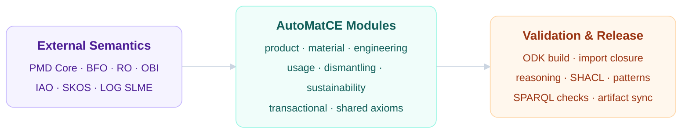
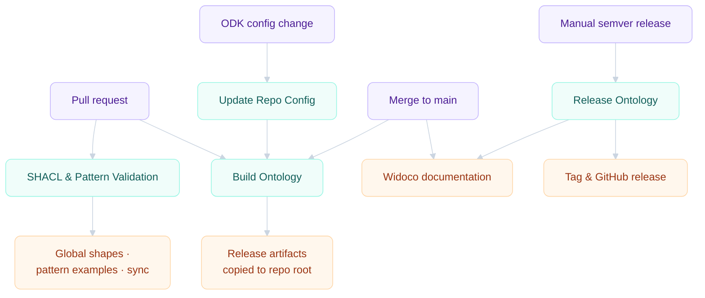

<div align="center">

<a href="https://w3id.org/pmd/automatce.owl">
  
</a>

# Automotive Circular Economy Ontology

An application ontology for automotive circular economy data — products, materials,
dismantling, reuse, recycling, footprints, logistics, usage, simulation, and
transactional records.

<a href="automatce.owl"></a>
<a href="automatce.ttl"></a>
<a href="automatce.json"></a>
<a href="src/shapes/automatce-ontology-shapes.ttl"></a>
<a href="src/patterns"></a>
<a href="LICENSE"></a>

<br>

<a href=".github/workflows/qc.yml"></a>
<a href=".github/workflows/shacl.yml"></a>
<a href=".github/workflows/release.yml"></a>

<sub>
  <a href="#overview">Overview</a> &nbsp;•&nbsp;
  <a href="#downloads">Downloads</a> &nbsp;•&nbsp;
  <a href="#architecture">Architecture</a> &nbsp;•&nbsp;
  <a href="#component-map">Components</a> &nbsp;•&nbsp;
  <a href="#pattern-library">Patterns</a> &nbsp;•&nbsp;
  <a href="#continuous-integration">CI</a> &nbsp;•&nbsp;
  <a href="#editor-workflow">Workflow</a>
</sub>

</div>

---

## Overview

AutoMatCE models circular economy scenarios across the automotive domain. It ships
classes, object properties, worked examples, release artifacts, SHACL shapes, and
reusable modeling patterns — enabling interoperable data exchange between design,
manufacturing, use, dismantling, recycling, sustainability, and logistics systems.

<table>
  <tr>
    <td width="25%" valign="top">
      <strong>Product Identity</strong><br>
      <sub>Vehicle, component, part, batch, VIN, BPN, manufacturer records, and product metadata.</sub>
    </td>
    <td width="25%" valign="top">
      <strong>Material Intelligence</strong><br>
      <sub>Polymers, composites, material composition, pVT data, and simulation-ready parameters.</sub>
    </td>
    <td width="25%" valign="top">
      <strong>Circular Decisions</strong><br>
      <sub>Reuse, remanufacturing, recycling, dismantlability, quality, condition, damage, and waste codes.</sub>
    </td>
    <td width="25%" valign="top">
      <strong>Evidence Layer</strong><br>
      <sub>Lifecycle stages, carbon footprints, usage spectra, service life, and auditable value specs.</sub>
    </td>
  </tr>
</table>

## Downloads

Each release ships in three serializations. CI keeps the root files synchronized
with the generated artifacts under `src/ontology`.

<table>
  <tr>
    <th align="left">Variant</th>
    <th align="center">OWL</th>
    <th align="center">Turtle</th>
    <th align="center">JSON-LD</th>
    <th align="left">Use when</th>
  </tr>
  <tr>
    <td><strong>Main</strong></td>
    <td align="center"><a href="automatce.owl">owl</a></td>
    <td align="center"><a href="automatce.ttl">ttl</a></td>
    <td align="center"><a href="automatce.json">json</a></td>
    <td>You need the standard public release.</td>
  </tr>
  <tr>
    <td><strong>Full</strong></td>
    <td align="center"><a href="automatce-full.owl">owl</a></td>
    <td align="center"><a href="automatce-full.ttl">ttl</a></td>
    <td align="center"><a href="automatce-full.json">json</a></td>
    <td>You need import-merged semantics for reasoning or inspection.</td>
  </tr>
  <tr>
    <td><strong>Base</strong></td>
    <td align="center"><a href="automatce-base.owl">owl</a></td>
    <td align="center"><a href="automatce-base.ttl">ttl</a></td>
    <td align="center"><a href="automatce-base.json">json</a></td>
    <td>You need the AutoMatCE layer without full external closure.</td>
  </tr>
</table>

## Architecture

The ontology is organized in three layers — external semantic commitments, the
AutoMatCE domain modules, and the validation plane that turns edited OWL into
synchronized release artifacts.

<table>
  <tr>
    <td width="33%" valign="top">
      <strong>1 · External Semantics</strong>
      <br><br>
      <sub><strong>PMD Core</strong>, <strong>BFO</strong>, <strong>RO</strong>, <strong>OBI</strong>, <strong>IAO</strong>, <strong>SKOS</strong>, and <strong>LOG SLME</strong> supply reusable upper, relation, annotation, and logistics terms.</sub>
    </td>
    <td width="33%" valign="top">
      <strong>2 · AutoMatCE Modules</strong>
      <br><br>
      <sub>Product, material, engineering, usage, dismantling, sustainability, transactional, and shared-axiom components hold the curated application ontology.</sub>
    </td>
    <td width="33%" valign="top">
      <strong>3 · Validation &amp; Release</strong>
      <br><br>
      <sub>ODK builds, reasoning, SHACL shapes, pattern examples, SPARQL checks, and artifact sync guard every release.</sub>
    </td>
  </tr>
</table>



## Ontology Workbench

<table>
  <tr>
    <td width="33%" valign="top">
      <strong>Editors' Source</strong><br>
      <sub><a href="src/ontology/automatce-edit.owl">automatce-edit.owl</a> is the entry point for editors. Most curated content lives in component modules.</sub>
    </td>
    <td width="33%" valign="top">
      <strong>Component Modules</strong><br>
      <sub><a href="src/ontology/components">src/ontology/components</a> holds the modular OWL file for each application area.</sub>
    </td>
    <td width="33%" valign="top">
      <strong>Release Sync</strong><br>
      <sub><a href="src/scripts/validate_release_artifacts.py">validate_release_artifacts.py</a> blocks stale root release files.</sub>
    </td>
  </tr>
  <tr>
    <td width="33%" valign="top">
      <strong>Ontology Shapes</strong><br>
      <sub><a href="src/shapes/automatce-ontology-shapes.ttl">automatce-ontology-shapes.ttl</a> checks labels, definitions, examples, value specs, object-property metadata, and controlled vocabulary.</sub>
    </td>
    <td width="33%" valign="top">
      <strong>Pattern Examples</strong><br>
      <sub><a href="src/patterns">src/patterns</a> contains repeatable modeling recipes with SHACL example data.</sub>
    </td>
    <td width="33%" valign="top">
      <strong>Competency Queries</strong><br>
      <sub><a href="src/patterns/queries">src/patterns/queries</a> holds SPARQL queries for composition, pVT, logistics, lifecycle, and dismantling.</sub>
    </td>
  </tr>
</table>

## Component Map

| Component | Modeling surface | File |
| :-- | :-- | :-- |
| **Shared** | bridge annotations, external stubs, hierarchy display fixes | [automatce-shared.owl](src/ontology/components/automatce-shared.owl) |
| **Shared axioms** | local object properties, domains, ranges, cross-module links | [automatce-axioms-shared.owl](src/ontology/components/automatce-axioms-shared.owl) |
| **Product data** | products, parts, batches, vehicle information | [automatce-product_data.owl](src/ontology/components/automatce-product_data.owl) |
| **Material data** | materials, polymers, composites, composition, pVT | [automatce-material_data.owl](src/ontology/components/automatce-material_data.owl) |
| **Engineering data** | mechanical properties, processing temperatures, simulation cards | [automatce-engineering_data.owl](src/ontology/components/automatce-engineering_data.owl) |
| **Usage data** | service life, load spectra, age, status, incidents | [automatce-usage_data.owl](src/ontology/components/automatce-usage_data.owl) |
| **Dismantling info** | dismantling, quality, condition, waste codes, circular routes | [automatce-dismantling_information.owl](src/ontology/components/automatce-dismantling_information.owl) |
| **Sustainability data** | footprint, lifecycle stage, scenario carbon footprint | [automatce-sustainability_data.owl](src/ontology/components/automatce-sustainability_data.owl) |
| **Transactional data** | manufacturer, sites, BPN, VIN, vehicle model, production dates | [automatce-transactional_data.owl](src/ontology/components/automatce-transactional_data.owl) |

## Pattern Library

Reusable modeling recipes, each shipped with SHACL shapes and validated example data.

| Pattern | Models | Validation |
| :-- | :-- | :-- |
| [identifier](src/patterns/identifier) | VIN, batch IDs, BPN, manufacturer numbers, local identifiers | identifier value and denoted entity |
| [quantitative attribute](src/patterns/quantitative-attribute) | numeric qualities and scalar value specifications | numeric value and optional unit IRI |
| [material composition](src/patterns/material-composition) | products, components, batches, and materials linked to composition records | composition link and readable record label |
| [process input output](src/patterns/process-input-output) | manufacturing, dismantling, recycling, and logistics processes | participant, input, output, and plan specification |
| [lifecycle footprint](src/patterns/lifecycle-footprint) | carbon footprint values and lifecycle context | amount, unit, and aboutness link |
| [logistics transfer](src/patterns/logistics-transfer) | recycling batches, actors, and reverse-chain transfer records | batch-to-actor relation |
| [pVT data point](src/patterns/pressure-volume-temperature-data-point) | pressure, temperature, and specific-volume tuples | one pressure, one temperature, one specific-volume datum |
| [dismantling information](src/patterns/dismantling-information) | instructions, dismantlability, tools, timing, and safety data | instruction plan and disposition relationships |
| [condition damage assessment](src/patterns/condition-damage-assessment) | body-part quality, vehicle condition, damage, corroded regions | quality inherence and PMD corrosion reuse |

<details>
<summary><strong>Full pattern index</strong></summary>

<br>

**Additional patterns**

- [controlled vocabulary concept](src/patterns/controlled-vocabulary-concept)
- [circular strategy selection](src/patterns/circular-strategy-selection)
- [object property bridge](src/patterns/object-property-bridge)

**SPARQL competency queries**

- [material-composition.rq](src/patterns/queries/material-composition.rq)
- [process-input-output.rq](src/patterns/queries/process-input-output.rq)
- [circular-strategy-footprint.rq](src/patterns/queries/circular-strategy-footprint.rq)
- [recycling-batch-transfer.rq](src/patterns/queries/recycling-batch-transfer.rq)
- [pvt-data-point.rq](src/patterns/queries/pvt-data-point.rq)
- [dismantling-condition.rq](src/patterns/queries/dismantling-condition.rq)

</details>

## Continuous Integration

Every change flows through GitHub Actions — build, validate, and release.



| Workflow | File | What it does |
| :-- | :-- | :-- |
| **Build Ontology** | [qc.yml](.github/workflows/qc.yml) | Builds ODK artifacts, runs checks, copies root release files |
| **SHACL & Pattern Validation** | [shacl.yml](.github/workflows/shacl.yml) | Validates global SHACL, pattern examples, SPARQL syntax, and release sync |
| **Update Repo Config** | [update-repo.yml](.github/workflows/update-repo.yml) | Syncs generated ODK repository files after reviewed config changes |
| **Release Ontology** | [release.yml](.github/workflows/release.yml) | Validates, stamps, uploads, tags, and publishes a semver release |
| **Widoco Documentation** | [docs.yml](.github/workflows/docs.yml) | Generates human-readable ontology documentation |

## Editor Workflow

<table>
  <tr>
    <td width="22%"><strong>1 · Choose module</strong></td>
    <td>Edit the component that owns the term — product, material, engineering, usage, dismantling, sustainability, transactional, or shared axioms.</td>
  </tr>
  <tr>
    <td width="22%"><strong>2 · Curate term</strong></td>
    <td>Add label, superclass, equivalence where needed, Aristotelian definition, example, datatype/unit comment, and semantic axioms.</td>
  </tr>
  <tr>
    <td width="22%"><strong>3 · Add evidence</strong></td>
    <td>If the modeling style is reusable, update or add a pattern with <code>pattern.md</code>, <code>shape.ttl</code>, and <code>shape-data.ttl</code>.</td>
  </tr>
  <tr>
    <td width="22%"><strong>4 · Open PR</strong></td>
    <td>GitHub Actions builds the ontology, validates SHACL, checks pattern examples, and verifies release artifact sync.</td>
  </tr>
</table>

## Repository Layout

```text
.
├── automatce.owl · automatce.ttl · automatce.json      # main release
├── automatce-full.*  ·  automatce-base.*               # full & base variants
├── README.md · LICENSE · CONTRIBUTING.md
├── .github/workflows/
│   ├── qc.yml            # build ontology
│   ├── shacl.yml         # SHACL & pattern validation
│   ├── update-repo.yml   # ODK config sync
│   ├── release.yml       # semver release
│   └── docs.yml          # Widoco docs
└── src/
    ├── ontology/
    │   ├── components/   # modular OWL per application area
    │   ├── imports/      # external import modules
    │   ├── automatce-edit.owl
    │   └── automatce-odk.yaml
    ├── patterns/         # modeling recipes + SPARQL queries
    ├── shapes/           # global SHACL shapes
    ├── sparql/           # validation queries
    └── scripts/          # release validation tooling
```

## Governance

<details>
<summary><strong>Term request checklist</strong></summary>

<br>

- Give the intended label and module.
- State whether the concept is a class, property, value specification, identifier, quality, process, role, or information content entity.
- Provide the closest known superclass or equivalent class.
- Provide one concrete automotive circular economy example.
- Include datatype and unit expectations for quantitative values.

</details>

<details>
<summary><strong>Release checklist</strong></summary>

<br>

- Build Ontology workflow is green.
- SHACL and Pattern Validation workflow is green.
- Root artifacts match `src/ontology` artifacts.
- `automatce.ttl`, `automatce.owl`, and `automatce.json` carry the expected version IRI.
- Manual Release Ontology workflow runs with `dry_run=false` only after review.

</details>

## License & Acknowledgements

AutoMatCE is released under [CC-BY-4.0](LICENSE).

Managed with the [Ontology Development Kit](https://github.com/INCATools/ontology-development-kit)
and aligned with the [PMD Core ontology](https://github.com/materialdigital/core-ontology).
